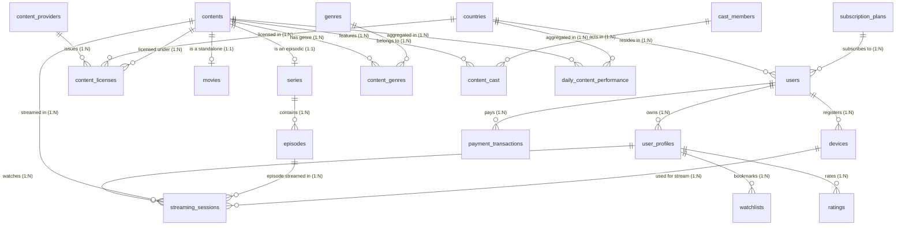

# 📐 Section 2: ERD & Logical Schema Design
## VOD Streaming Service Relational Schema

This document details the logical schema design and Entity-Relationship Diagram (ERD) using Crow's Foot notation for the VOD Streaming Service database.

---

## 1. Crow's Foot ERD Diagram (Mermaid)

---

## 2. Comprehensive Relational Schema Specifications

### A. User & Monetization Domain
- **`countries`**: `country_id` (PK, INT), `country_code` (VARCHAR(3), UNIQUE), `country_name` (VARCHAR(100)).
- **`subscription_plans`**: `plan_id` (PK, INT), `plan_name` (VARCHAR(50)), `monthly_price` (NUMERIC(10,2)), `max_concurrent_streams` (INT), `max_resolution` (VARCHAR(10)), `has_ads` (BOOLEAN).
- **`users`**: `user_id` (PK, INT), `email` (VARCHAR(255), UNIQUE), `password_hash` (VARCHAR(255)), `country_id` (FK -> `countries`), `plan_id` (FK -> `subscription_plans`), `account_status` (VARCHAR(20)), `created_at` (TIMESTAMP).
- **`user_profiles`**: `profile_id` (PK, INT), `user_id` (FK -> `users` ON DELETE CASCADE), `profile_name` (VARCHAR(50)), `is_kids` (BOOLEAN), `maturity_rating_limit` (VARCHAR(10)), `created_at` (TIMESTAMP).
- **`devices`**: `device_id` (PK, INT), `user_id` (FK -> `users` ON DELETE CASCADE), `device_name` (VARCHAR(100)), `device_type` (VARCHAR(50)), `os` (VARCHAR(50)), `last_used_at` (TIMESTAMP).
- **`payment_transactions`**: `transaction_id` (PK, INT), `user_id` (FK -> `users` ON DELETE SET NULL), `amount` (NUMERIC(10,2)), `payment_method` (VARCHAR(50)), `status` (VARCHAR(20)), `paid_at` (TIMESTAMP).

### B. Catalog Domain
- **`contents`**: `content_id` (PK, INT), `title` (VARCHAR(255)), `description` (TEXT), `release_year` (INT), `age_rating` (VARCHAR(10)), `content_type` (VARCHAR(10): 'MOVIE'|'SERIES'), `created_at` (TIMESTAMP).
- **`movies`**: `movie_id` (PK, INT), `content_id` (FK UNIQUE -> `contents` ON DELETE CASCADE), `duration_minutes` (INT), `video_stream_url` (TEXT).
- **`series`**: `series_id` (PK, INT), `content_id` (FK UNIQUE -> `contents` ON DELETE CASCADE), `total_seasons` (INT).
- **`episodes`**: `episode_id` (PK, INT), `series_id` (FK -> `series` ON DELETE CASCADE), `season_number` (INT), `episode_number` (INT), `title` (VARCHAR(255)), `duration_minutes` (INT), `video_stream_url` (TEXT), UNIQUE(`series_id`, `season_number`, `episode_number`).
- **`genres`**: `genre_id` (PK, INT), `genre_name` (VARCHAR(50), UNIQUE).
- **`content_genres`**: Composite PK(`content_id`, `genre_id`), FK -> `contents`, FK -> `genres`.
- **`cast_members`**: `cast_id` (PK, INT), `name` (VARCHAR(100)), `role_type` (VARCHAR(50)).
- **`content_cast`**: Composite PK(`content_id`, `cast_id`), FK -> `contents`, FK -> `cast_members`.

### C. Licensing & Geo-Restriction Domain
- **`content_providers`**: `provider_id` (PK, INT), `provider_name` (VARCHAR(100)), `contact_email` (VARCHAR(255)).
- **`content_licenses`**: `license_id` (PK, INT), `content_id` (FK -> `contents`), `provider_id` (FK -> `content_providers`), `country_id` (FK -> `countries`), `start_date` (DATE), `end_date` (DATE), `license_cost` (NUMERIC(12,2)).

### D. Playback & Analytics Domain
- **`streaming_sessions`**: `session_id` (PK, BIGINT), `profile_id` (FK -> `user_profiles` ON DELETE CASCADE), `content_id` (FK -> `contents`), `episode_id` (FK -> `episodes`), `device_id` (FK -> `devices`), `start_time` (TIMESTAMP), `end_time` (TIMESTAMP), `watch_duration_seconds` (INT), `is_completed` (BOOLEAN), `max_bitrate_kbps` (INT), `user_ip` (VARCHAR(45)).
- **`ratings`**: Composite PK(`profile_id`, `content_id`), `rating_score` (INT 1-5), `reviewed_at` (TIMESTAMP).
- **`daily_content_performance`**: Composite PK(`stat_date`, `content_id`, `country_id`), `total_plays` (INT), `total_watch_hours` (NUMERIC(10,2)), `completion_count` (INT), `unique_viewers` (INT).
