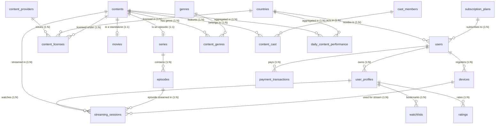

# 📐 Penjelasan Detail Relasi Antar Tabel (Logical Schema & ERD)
## Database VOD Streaming Service (Penjelasan Lengkap Kardinalitas & Foreign Key)

Dokumen ini menjelaskan **secara mendetail seluruh relasi antar tabel** dalam database VOD Streaming Service baru Anda, mencakup jenis relasi (1-to-1, 1-to-Many, Many-to-Many), Foreign Key (FK), dan Aturan Bisnis yang diterapkan.

---

## 🗺️ 1. Diagram ERD (Crow's Foot Notation)

---

## 🔍 2. Rincian Detail Relasi per Kelompok Domain

---

### A. Domain Pengguna & Berlangganan (User & Subscription Domain)

#### 1. `countries` ───< `users` (One-to-Many / 1:N)
- **Primary Key (PK):** `countries.country_id`
- **Foreign Key (FK):** `users.country_id`
- **Penjelasan Relasi:** 1 Negara dapat menjadi tempat tinggal bagi **banyak Pengguna** (`users`), namun 1 Pengguna hanya terdaftar di **1 Negara utama**.
- **Aturan Bisnis / FK Behavior:** `ON DELETE RESTRICT`. Negara tidak boleh dihapus jika masih ada pengguna yang terdaftar di negara tersebut.

#### 2. `subscription_plans` ───< `users` (One-to-Many / 1:N)
- **Primary Key (PK):** `subscription_plans.plan_id`
- **Foreign Key (FK):** `users.plan_id`
- **Penjelasan Relasi:** 1 Paket Langganan (misal: *Premium 4K*) dipilihi oleh **banyak Pengguna**, tetapi 1 Pengguna hanya memiliki **1 Paket Langganan aktif**.
- **Aturan Bisnis / FK Behavior:** `ON DELETE SET NULL`. Jika paket langganan dihapus dari sistem, `plan_id` pengguna diubah menjadi `NULL` sampai pengguna memilih paket baru.

#### 3. `users` ───< `user_profiles` (One-to-Many / 1:N)
- **Primary Key (PK):** `users.user_id`
- **Foreign Key (FK):** `user_profiles.user_id`
- **Penjelasan Relasi:** 1 Akun Pengguna (`users`) dapat membuat **banyak Profil Penonton** (`user_profiles` misal: Profil Ayah, Profil Ibu, Profil Anak), namun 1 Profil Penonton hanya dimiliki oleh **1 Akun Pengguna**.
- **Aturan Bisnis / FK Behavior:** `ON DELETE CASCADE`. Jika Akun Pengguna dihapus permanen, seluruh Profil di bawah akun tersebut otomatis ikut terhapus.

#### 4. `users` ───< `devices` (One-to-Many / 1:N)
- **Primary Key (PK):** `users.user_id`
- **Foreign Key (FK):** `devices.user_id`
- **Penjelasan Relasi:** 1 Akun Pengguna dapat mendaftarkan **banyak Perangkat** (Smart TV, HP, Laptop), namun 1 Perangkat terikat pada **1 Akun Pengguna**.
- **Aturan Bisnis / FK Behavior:** `ON DELETE CASCADE`. Jika Akun dihapus, daftar perangkat terdaftarnya ikut terhapus.

#### 5. `users` ───< `payment_transactions` (One-to-Many / 1:N)
- **Primary Key (PK):** `users.user_id`
- **Foreign Key (FK):** `payment_transactions.user_id`
- **Penjelasan Relasi:** 1 Akun Pengguna dapat melakukan **banyak Transaksi Pembayaran** bulanan, namun 1 Transaksi Pembayaran dimiliki oleh **1 Akun Pengguna**.
- **Aturan Bisnis / FK Behavior:** `ON DELETE SET NULL` / Soft Delete. Jika Akun dihapus, catatan transaksi keuangan **tetap disimpan** untuk pembukuan akuntansi, dengan `user_id` menjadi `NULL` (anonim).

---

### B. Domain Katalog Konten (Content Catalog Domain)

#### 6. `contents` ────── `movies` (One-to-One / 1:1)
- **Primary Key (PK):** `contents.content_id`
- **Foreign Key (FK):** `movies.content_id` (`UNIQUE`)
- **Penjelasan Relasi:** Memisahkan metadata umum dengan rincian Film Lepas. 1 Konten berjenis `'MOVIE'` memiliki tepat **1 rincian durasi film lepas** (`movies`).
- **Aturan Bisnis / FK Behavior:** `ON DELETE CASCADE`. Jika Konten induk dihapus, data detail film lepasnya ikut terhapus.

#### 7. `contents` ────── `series` (One-to-One / 1:1)
- **Primary Key (PK):** `contents.content_id`
- **Foreign Key (FK):** `series.content_id` (`UNIQUE`)
- **Penjelasan Relasi:** 1 Konten berjenis `'SERIES'` memiliki tepat **1 rincian serial TV** (`series`).
- **Aturan Bisnis / FK Behavior:** `ON DELETE CASCADE`.

#### 8. `series` ───< `episodes` (One-to-Many / 1:N)
- **Primary Key (PK):** `series.series_id`
- **Foreign Key (FK):** `episodes.series_id`
- **Penjelasan Relasi:** 1 Serial TV memiliki **banyak Episode** bertingkat (*Season 1 Ep 1, Season 1 Ep 2*), namun 1 Episode hanya milik **1 Serial TV**.
- **Aturan Bisnis / FK Behavior:** `ON DELETE CASCADE`. Unique constraint diatur pada `(series_id, season_number, episode_number)`.

#### 9. `contents` ───< `content_genres` >─── `genres` (Many-to-Many / M:N)
- **Tabel Junction:** `content_genres`
- **Foreign Keys:** `content_genres.content_id` & `content_genres.genre_id`
- **Penjelasan Relasi:** 1 Film/Serial bisa memiliki **banyak Genre** (misal: *Inception* = Action + Sci-Fi), dan 1 Genre menampung **banyak Film/Serial**.

#### 10. `contents` ───< `content_cast` >─── `cast_members` (Many-to-Many / M:N)
- **Tabel Junction:** `content_cast`
- **Foreign Keys:** `content_cast.content_id` & `content_cast.cast_id`
- **Penjelasan Relasi:** 1 Film/Serial dibintangi oleh **banyak Pemeran/Kru**, dan 1 Aktor/Sutradara dapat membintangi **banyak Film/Serial**.

---

### C. Domain Lisensi & Wilayah (Licensing & Geo Domain)

#### 11. `content_providers` + `contents` + `countries` ───< `content_licenses`
- **Primary Keys:** `provider_id`, `content_id`, `country_id`
- **Foreign Keys di `content_licenses`:** 
  - `content_id REFERENCES contents(content_id)`
  - `provider_id REFERENCES content_providers(provider_id)`
  - `country_id REFERENCES countries(country_id)`
- **Penjelasan Relasi:** Menghubungkan 3 tabel sekaligus. 1 Lisensi mencatat bahwa **1 Konten** dari **1 Studio Provider** memiliki hak tayang sah di **1 Negara** untuk rentang tanggal tertentu (`start_date` s/d `end_date`).

---

### D. Domain Playback, Interaksi, & Analitik (Playback & Analytics Domain)

#### 12. `user_profiles` ───< `streaming_sessions` (One-to-Many / 1:N)
- **Foreign Key:** `streaming_sessions.profile_id`
- **Penjelasan Relasi:** 1 Profil Penonton memiliki **banyak Riwayat Sesi Streaming**, namun 1 Sesi Pemutaran hanya dilakukan oleh **1 Profil Penonton**.

#### 13. `contents` & `episodes` ───< `streaming_sessions` (One-to-Many / 1:N)
- **Foreign Keys:** `streaming_sessions.content_id` & `streaming_sessions.episode_id` (NULLable untuk film lepas)
- **Penjelasan Relasi:** 1 Judul Konten/Episode diputar dalam **banyak Sesi Streaming** oleh berbagai pengguna.

#### 14. `user_profiles` ───< `ratings` (One-to-Many / 1:N)
- **Foreign Keys:** `ratings.profile_id` & `ratings.content_id` (Composite PK: `profile_id, content_id`)
- **Penjelasan Relasi:** 1 Profil Penonton memberikan nilai rating (1-5 bintang) untuk **banyak Film**, dan 1 Profil hanya boleh memberi **1 Rating per Film**.

#### 15. `contents` & `countries` ───< `daily_content_performance` (One-to-Many OLAP Aggregate)
- **Composite Primary Key:** `(stat_date, content_id, country_id)`
- **Penjelasan Relasi:** Tabel ringkasan harian (denormalisasi) yang mengagregasikan total pemutaran, total jam tonton, dan tingkat penyelesaian per film per negara per hari dari jutaan baris `streaming_sessions`.

---

## 💡 Ringkasan Jawaban Singkat untuk Dosen

Jika Dosen bertanya: *"Jelaskan relasi utama di database kamu!"*

> **Jawaban:**
> *"Database kami terbagi menjadi 4 domain utama:*
> 1. **User Domain (1:N):** 1 Akun `users` punya banyak `user_profiles` (profil penonton) & `devices` dengan aturan `ON DELETE CASCADE`.
> 2. **Catalog Domain (1:1 & 1:N):** Metadata di `contents` berelasi 1-to-1 ke `movies` atau `series`, di mana `series` punya relasi 1-to-Many ke `episodes`.
> 3. **Licensing Domain (M:N):** `content_licenses` mengatur hak tayang film per studio per negara berdasarkan jendela tanggal.
> 4. **Playback Domain (1:N & OLAP):** Setiap aktivitas ditangkap di `streaming_sessions` yang terhubung ke `user_profiles`, `contents`, dan `devices`, yang kemudian di-agregasi harian ke tabel OLAP `daily_content_performance`."*
