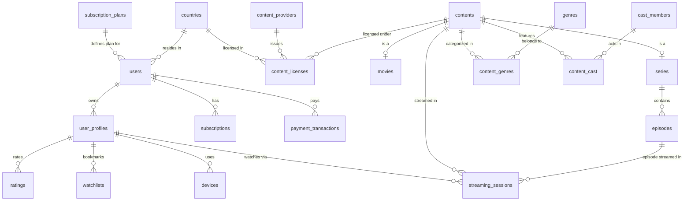

# 📘 Panduan Lengkap Langkah-demi-Langkah: Final Project Database Technology (VOD Streaming Service)

Dokumen ini dirancang sebagai **panduan utama dan blueprint** agar Anda dapat menyusun, menulis, dan mengeksekusi sendiri seluruh berkas tugas Final Project secara mandiri dan sistematis.

---

## 📂 Struktur File Tugas yang Disarankan untuk Disubmit

Buat folder tugas Anda di `/home/andrey/00PROJEK/` dengan struktur file berikut:

```
/home/andrey/00PROJEK/
├── docker-compose.yaml             # Lingkungan PostgreSQL & pgAdmin
├── 01-mapping-sakila-to-vod.md     # Tugas 1: Pemetaan Tabel & Justifikasi
├── 02-erd-and-logical-schema.md    # Tugas 2: Schema Logis & Diagram ERD
├── 03-schema-ddl.sql               # Tugas 3: Script SQL DDL & Indexing
├── 04-analytics-queries.sql        # Tugas 4: 6 Query Analitik + Tabel Agregat
├── 05-sample-data.sql              # Tugas 5: Data Sampel INSERT (>20 baris)
└── 06-final-report.md              # Tugas 6: Laporan Akhir & Rationale (1-2 Hal)
```

---

## 📑 Langkah 1: Pemetaan Sakila ke Streaming Domain (Bobot: 20%)

Tuliskan pemetaan tabel dari schema Sakila (DVD Rental) ke schema Streaming Service baru Anda di file `01-mapping-sakila-to-vod.md`.

### Tabel Referensi Pemetaan & Alasan (Justifikasi)

| Tabel Sakila Lama | Aksi | Tabel Streaming Baru | Alasan / Justifikasi |
| :--- | :--- | :--- | :--- |
| `film` | **Split & Evolve** | `contents`, `movies`, `series`, `episodes` | Toko DVD hanya menyewa film tunggal. Layanan streaming membedakan film lepas (*movies*) dan serial episodik bertingkat (*series & episodes*). Metadata dasar (judul, deskripsi, rating usia) disimpan di `contents`. |
| `category` & `film_category` | **Rename & Retain** | `genres` & `content_genres` | Kategori film diubah menjadi genre (Action, Sci-Fi, Drama) dengan relasi *many-to-many*. |
| `actor` & `film_actor` | **Rename & Expand** | `cast_members` & `content_cast` | Memperluas aktor menjadi pemeran & kru (Sutradara, Produser, Pemeran Utama). |
| `language` | **Retain** | `languages` | Diperlukan untuk melacak ketersediaan opsi *Audio Dubbing* dan *Subtitles*. |
| `customer` | **Evolve & Split** | `users` & `user_profiles` | Pada DVD rental, 1 pelanggan = 1 orang. Di layanan streaming, 1 akun (`users`) dapat memiliki banyak profil (`user_profiles` seperti Profil Anak, Profil Dewasa). |
| `address`, `city`, `country` | **Simplify** | `countries` | Disederhanakan untuk kebutuhan validasi wilayah lisensi (*geoblocking*) dan wilayah penagihan (*billing territory*). |
| `store` & `staff` | **Replace / Drop** | `content_providers` & `content_licenses` | Toko fisik & staf kasir tidak relevan di VOD. Digantikan oleh studio/penyedia konten dan hak lisensi tayang digital. |
| `inventory` | **Drop** | *(Dihapus)* | Stok fisik DVD kaset tidak ada lagi dalam pengaliran digital (*streaming*). |
| `rental` | **Replace** | `streaming_sessions` | Transaksi penyewaan fisik digantikan oleh sesi pemutaran digital yang mencatat durasi tonton, perangkat, IP, dan status penyelesaian. |
| `payment` | **Evolve** | `subscription_plans`, `subscriptions`, `payment_transactions` | Model pembayaran sewa per unit diubah menjadi langganan bulanan (*recurring subscription*) dan riwayat transaksi penagihan. |

---

## 📐 Langkah 2: Perancangan Schema Logis & ERD (Bobot: 20%)

Tuliskan spesifikasi entitas dan gambarkan Diagram ERD menggunakan format **Crow's Foot** di file `02-erd-and-logical-schema.md`. Anda bisa menggunakan kode **Mermaid** berikut untuk dirender:



---

## 🛠️ Langkah 3: Script SQL DDL & Indexing (Bobot: 20%)

Buat file `03-schema-ddl.sql` yang memuat seluruh perintah `CREATE TABLE`, Primary Key, Foreign Key, Constraint, dan Index Analitik.

### DDL Blueprint & Contoh Sintaks:

```sql
-- 1. Ekstensi & Cleanup
CREATE EXTENSION IF NOT EXISTS "uuid-ossp";

DROP TABLE IF EXISTS streaming_sessions CASCADE;
DROP TABLE IF EXISTS watchlists CASCADE;
DROP TABLE IF EXISTS ratings CASCADE;
DROP TABLE IF EXISTS episodes CASCADE;
DROP TABLE IF EXISTS series CASCADE;
DROP TABLE IF EXISTS movies CASCADE;
DROP TABLE IF EXISTS content_licenses CASCADE;
DROP TABLE IF EXISTS content_genres CASCADE;
DROP TABLE IF EXISTS content_cast CASCADE;
DROP TABLE IF EXISTS contents CASCADE;
DROP TABLE IF EXISTS genres CASCADE;
DROP TABLE IF EXISTS cast_members CASCADE;
DROP TABLE IF EXISTS content_providers CASCADE;
DROP TABLE IF EXISTS devices CASCADE;
DROP TABLE IF EXISTS user_profiles CASCADE;
DROP TABLE IF EXISTS payment_transactions CASCADE;
DROP TABLE IF EXISTS subscriptions CASCADE;
DROP TABLE IF EXISTS users CASCADE;
DROP TABLE IF EXISTS subscription_plans CASCADE;
DROP TABLE IF EXISTS countries CASCADE;

-- 2. Wilayah & Langganan
CREATE TABLE countries (
    country_id SERIAL PRIMARY KEY,
    country_code VARCHAR(3) UNIQUE NOT NULL,
    country_name VARCHAR(100) NOT NULL
);

CREATE TABLE subscription_plans (
    plan_id SERIAL PRIMARY KEY,
    plan_name VARCHAR(50) NOT NULL,
    monthly_price NUMERIC(10,2) NOT NULL CHECK (monthly_price >= 0),
    max_concurrent_streams INT NOT NULL DEFAULT 1 CHECK (max_concurrent_streams > 0),
    max_resolution VARCHAR(10) NOT NULL CHECK (max_resolution IN ('SD', 'HD', '4K')),
    has_ads BOOLEAN NOT NULL DEFAULT FALSE
);

CREATE TABLE users (
    user_id SERIAL PRIMARY KEY,
    email VARCHAR(255) UNIQUE NOT NULL,
    password_hash VARCHAR(255) NOT NULL,
    country_id INT NOT NULL REFERENCES countries(country_id),
    plan_id INT REFERENCES subscription_plans(plan_id),
    account_status VARCHAR(20) NOT NULL DEFAULT 'ACTIVE' CHECK (account_status IN ('ACTIVE', 'SUSPENDED', 'CANCELLED')),
    created_at TIMESTAMP WITH TIME ZONE DEFAULT CURRENT_TIMESTAMP
);

CREATE TABLE user_profiles (
    profile_id SERIAL PRIMARY KEY,
    user_id INT NOT NULL REFERENCES users(user_id) ON DELETE CASCADE,
    profile_name VARCHAR(50) NOT NULL,
    is_kids BOOLEAN NOT NULL DEFAULT FALSE,
    maturity_rating_limit VARCHAR(10) DEFAULT 'TV-MA',
    created_at TIMESTAMP WITH TIME ZONE DEFAULT CURRENT_TIMESTAMP
);

CREATE TABLE devices (
    device_id SERIAL PRIMARY KEY,
    user_id INT NOT NULL REFERENCES users(user_id) ON DELETE CASCADE,
    device_name VARCHAR(100),
    device_type VARCHAR(50) CHECK (device_type IN ('SMART_TV', 'MOBILE', 'TABLET', 'WEB', 'CONSOLE')),
    os VARCHAR(50),
    last_used_at TIMESTAMP WITH TIME ZONE DEFAULT CURRENT_TIMESTAMP
);

-- 3. Katalog Konten (Movies & Series)
CREATE TABLE contents (
    content_id SERIAL PRIMARY KEY,
    title VARCHAR(255) NOT NULL,
    description TEXT,
    release_year INT CHECK (release_year >= 1900),
    age_rating VARCHAR(10) CHECK (age_rating IN ('G', 'PG', 'PG-13', 'R', 'NC-17', 'TV-Y', 'TV-14', 'TV-MA')),
    content_type VARCHAR(10) NOT NULL CHECK (content_type IN ('MOVIE', 'SERIES')),
    created_at TIMESTAMP WITH TIME ZONE DEFAULT CURRENT_TIMESTAMP
);

CREATE TABLE movies (
    movie_id SERIAL PRIMARY KEY,
    content_id INT UNIQUE NOT NULL REFERENCES contents(content_id) ON DELETE CASCADE,
    duration_minutes INT NOT NULL CHECK (duration_minutes > 0),
    video_stream_url TEXT NOT NULL
);

CREATE TABLE series (
    series_id SERIAL PRIMARY KEY,
    content_id INT UNIQUE NOT NULL REFERENCES contents(content_id) ON DELETE CASCADE,
    total_seasons INT DEFAULT 1 CHECK (total_seasons > 0)
);

CREATE TABLE episodes (
    episode_id SERIAL PRIMARY KEY,
    series_id INT NOT NULL REFERENCES series(series_id) ON DELETE CASCADE,
    season_number INT NOT NULL CHECK (season_number > 0),
    episode_number INT NOT NULL CHECK (episode_number > 0),
    title VARCHAR(255) NOT NULL,
    duration_minutes INT NOT NULL CHECK (duration_minutes > 0),
    video_stream_url TEXT NOT NULL,
    UNIQUE (series_id, season_number, episode_number)
);

-- 4. Lisensi Konten
CREATE TABLE content_providers (
    provider_id SERIAL PRIMARY KEY,
    provider_name VARCHAR(100) NOT NULL,
    contact_email VARCHAR(255)
);

CREATE TABLE content_licenses (
    license_id SERIAL PRIMARY KEY,
    content_id INT NOT NULL REFERENCES contents(content_id) ON DELETE CASCADE,
    provider_id INT NOT NULL REFERENCES content_providers(provider_id),
    country_id INT NOT NULL REFERENCES countries(country_id),
    start_date DATE NOT NULL,
    end_date DATE NOT NULL,
    license_cost NUMERIC(12,2) CHECK (license_cost >= 0),
    CHECK (end_date >= start_date)
);

-- 5. Playback & Interaksi Sesi Streaming
CREATE TABLE streaming_sessions (
    session_id BIGSERIAL PRIMARY KEY,
    profile_id INT NOT NULL REFERENCES user_profiles(profile_id) ON DELETE CASCADE,
    content_id INT NOT NULL REFERENCES contents(content_id),
    episode_id INT REFERENCES episodes(episode_id),
    device_id INT REFERENCES devices(device_id),
    start_time TIMESTAMP WITH TIME ZONE NOT NULL DEFAULT CURRENT_TIMESTAMP,
    end_time TIMESTAMP WITH TIME ZONE,
    watch_duration_seconds INT DEFAULT 0 CHECK (watch_duration_seconds >= 0),
    is_completed BOOLEAN DEFAULT FALSE,
    max_bitrate_kbps INT,
    user_ip VARCHAR(45)
);

CREATE TABLE ratings (
    profile_id INT NOT NULL REFERENCES user_profiles(profile_id) ON DELETE CASCADE,
    content_id INT NOT NULL REFERENCES contents(content_id) ON DELETE CASCADE,
    rating_score INT NOT NULL CHECK (rating_score BETWEEN 1 AND 5),
    reviewed_at TIMESTAMP WITH TIME ZONE DEFAULT CURRENT_TIMESTAMP,
    PRIMARY KEY (profile_id, content_id)
);

-- 6. Indexing untuk Beban Kerja Analitik (OLAP Optimization)
CREATE INDEX idx_sessions_content_time ON streaming_sessions(content_id, start_time);
CREATE INDEX idx_sessions_profile_time ON streaming_sessions(profile_id, start_time DESC);
CREATE INDEX idx_users_country_plan ON users(country_id, plan_id);
CREATE INDEX idx_licenses_geo ON content_licenses(country_id, start_date, end_date);
```

---

## 📊 Langkah 4: Merancang Query Analitik & Tabel Agregat (Bobot: 20%)

Buat file `04-analytics-queries.sql`. Di dalamnya buat **Tabel Agregat Harian** beserta 6 Query Analitik:

### A. DDL Tabel Agregat (`daily_content_performance`)
```sql
CREATE TABLE daily_content_performance (
    stat_date DATE NOT NULL,
    content_id INT NOT NULL REFERENCES contents(content_id),
    country_id INT NOT NULL REFERENCES countries(country_id),
    total_plays INT DEFAULT 0,
    total_watch_hours NUMERIC(10,2) DEFAULT 0,
    completion_count INT DEFAULT 0,
    unique_viewers INT DEFAULT 0,
    PRIMARY KEY (stat_date, content_id, country_id)
);
```

### B. 6 Query Analitik Wajib

#### 1. Daily Active Users (DAU) & Monthly Active Users (MAU)
```sql
SELECT 
    DATE(start_time) AS activity_date,
    COUNT(DISTINCT profile_id) AS daily_active_profiles,
    COUNT(DISTINCT device_id) AS daily_active_devices
FROM streaming_sessions
GROUP BY DATE(start_time)
ORDER BY activity_date DESC;
```

#### 2. Top Content by Watch Duration & Region (30 Hari Terakhir)
```sql
SELECT 
    c.country_name,
    cnt.title,
    cnt.content_type,
    ROUND(SUM(s.watch_duration_seconds) / 3600.0, 2) AS total_watch_hours,
    COUNT(s.session_id) AS total_sessions
FROM streaming_sessions s
JOIN user_profiles p ON s.profile_id = p.profile_id
JOIN users u ON p.user_id = u.user_id
JOIN countries c ON u.country_id = c.country_id
JOIN contents cnt ON s.content_id = cnt.content_id
WHERE s.start_time >= CURRENT_DATE - INTERVAL '30 days'
GROUP BY c.country_name, cnt.title, cnt.content_type
ORDER BY c.country_name, total_watch_hours DESC;
```

#### 3. User Retention Cohort Analysis
```sql
WITH user_cohorts AS (
    SELECT 
        user_id,
        DATE_TRUNC('month', created_at) AS cohort_month
    FROM users
),
user_activity AS (
    SELECT DISTINCT
        p.user_id,
        DATE_TRUNC('month', s.start_time) AS activity_month
    FROM streaming_sessions s
    JOIN user_profiles p ON s.profile_id = p.profile_id
)
SELECT 
    uc.cohort_month,
    ua.activity_month,
    COUNT(DISTINCT uc.user_id) AS total_cohort_users,
    COUNT(DISTINCT ua.user_id) AS active_retained_users,
    ROUND((COUNT(DISTINCT ua.user_id)::NUMERIC / COUNT(DISTINCT uc.user_id)) * 100, 2) AS retention_rate_pct
FROM user_cohorts uc
LEFT JOIN user_activity ua ON uc.user_id = ua.user_id AND ua.activity_month >= uc.cohort_month
GROUP BY uc.cohort_month, ua.activity_month
ORDER BY uc.cohort_month, ua.activity_month;
```

#### 4. Drop-off Analysis (Completion Rate < 20%)
```sql
SELECT 
    cnt.title,
    cnt.content_type,
    COUNT(s.session_id) AS total_starts,
    COUNT(CASE WHEN s.is_completed THEN 1 END) AS completions,
    COUNT(CASE WHEN (s.watch_duration_seconds / NULLIF(m.duration_minutes * 60, 0)) < 0.20 THEN 1 END) AS early_dropoffs,
    ROUND(
        (COUNT(CASE WHEN (s.watch_duration_seconds / NULLIF(m.duration_minutes * 60, 0)) < 0.20 THEN 1 END)::NUMERIC 
        / COUNT(s.session_id)) * 100, 2
    ) AS dropoff_rate_pct
FROM streaming_sessions s
JOIN contents cnt ON s.content_id = cnt.content_id
LEFT JOIN movies m ON cnt.content_id = m.content_id
GROUP BY cnt.title, cnt.content_type
HAVING COUNT(s.session_id) > 0
ORDER BY dropoff_rate_pct DESC;
```

#### 5. Churn Risk Indicator (Pengguna Berlangganan Tanpa Aktivitas 14 Hari)
```sql
SELECT 
    u.user_id,
    u.email,
    sp.plan_name,
    MAX(s.start_time) AS last_stream_date,
    CURRENT_DATE - DATE(MAX(s.start_time)) AS days_inactive
FROM users u
JOIN subscription_plans sp ON u.plan_id = sp.plan_id
JOIN user_profiles p ON u.user_id = p.user_id
LEFT JOIN streaming_sessions s ON p.profile_id = s.profile_id
WHERE u.account_status = 'ACTIVE'
GROUP BY u.user_id, u.email, sp.plan_name
HAVING MAX(s.start_time) < CURRENT_DATE - INTERVAL '14 days' OR MAX(s.start_time) IS NULL
ORDER BY days_inactive DESC;
```

#### 6. Co-Watching Recommendation Matrix (Judul yang Sering Ditonton Bersama)
```sql
SELECT 
    c1.title AS content_a,
    c2.title AS content_b,
    COUNT(DISTINCT s1.profile_id) AS co_watch_profile_count
FROM streaming_sessions s1
JOIN streaming_sessions s2 ON s1.profile_id = s2.profile_id AND s1.content_id < s2.content_id
JOIN contents c1 ON s1.content_id = c1.content_id
JOIN contents c2 ON s2.content_id = c2.content_id
WHERE ABS(EXTRACT(EPOCH FROM (s1.start_time - s2.start_time))) <= 604800 -- ditonton dalam rentang 7 hari
GROUP BY c1.title, c2.title
ORDER BY co_watch_profile_count DESC
LIMIT 10;
```

---

## 📝 Langkah 5: Penyiapan Data Sampel INSERT (Bobot: 10%)

Buat file `05-sample-data.sql`. Isikan data sampel yang mencakup seluruh tabel dasar:
- Minimal 3-5 Negara (`Indonesia`, `United States`, `Japan`, dll.)
- Minimal 3 Paket Langganan (`Basic`, `Standard`, `Premium`)
- Minimal 10 `users` dan 15 `user_profiles`
- Minimal 10 `contents` (kombinasi Movies & Series dengan Episodenya)
- Minimal 20+ baris `streaming_sessions` untuk menghasilkan output query analitik yang kaya.

---

## 📄 Langkah 6: Menyusun Laporan Akhir / Write-up (Bobot: 10%)

Tuliskan dokumen laporan 1-2 halaman di file `06-final-report.md` mencakup 4 poin wajib:

1. **Desain & Transformasi Domain:** Alasan pengubahan Sakila (kaset fisik) menjadi streaming digital (1 Akun = Banyak Profil, lisensi wilayah, dll.).
2. **Kompromi Normalisasi (Normalization Tradeoffs):** Mengapa kita menggunakan bentuk normal 3NF pada OLTP (users, sessions), namun menyiagakan denormalisasi / agregat (`daily_content_performance`) untuk kueri analitik skala besar.
3. **Strategi Indexing & Partitioning:** Penggunaan Composite Index pada `(content_id, start_time)` untuk mempercepat kueri analitik agregasi tanpa melakukan *full table scan*.
4. **Privasi Data & Hukum (PII & Retention):**
   - Minimized PII: Pengunaan hash password (`password_hash`), tidak menyimpan detail kartu kredit secara mentah.
   - Anonymization & Retention Policy: Otomatisasi kompresi IP address dan penghapusan sesi streaming lama secara berkala sesuai regulasi GDPR / UU PDP.

---

## 🚀 Cara Menjalankan & Menguji di Terminal

Setelah Anda membuat file `03-schema-ddl.sql`, `05-sample-data.sql`, dan `04-analytics-queries.sql`, uji seluruh skrip Anda menggunakan PostgreSQL Docker container:

```bash
# 1. Jalankan container (jika belum running)
docker compose up -d

# 2. Eksekusi DDL (Membuat Tabel)
docker exec -i postgres_lab psql -U admin -d learning_db < 03-schema-ddl.sql

# 3. Eksekusi Insert Data Sampel
docker exec -i postgres_lab psql -U admin -d learning_db < 05-sample-data.sql

# 4. Eksekusi Query Analitik
docker exec -i postgres_lab psql -U admin -d learning_db < 04-analytics-queries.sql
```

Selamat mengerjakan! Seluruh panduan di atas sudah lengkap dan siap Anda pakai untuk menyusun tugas mandiri Anda.
